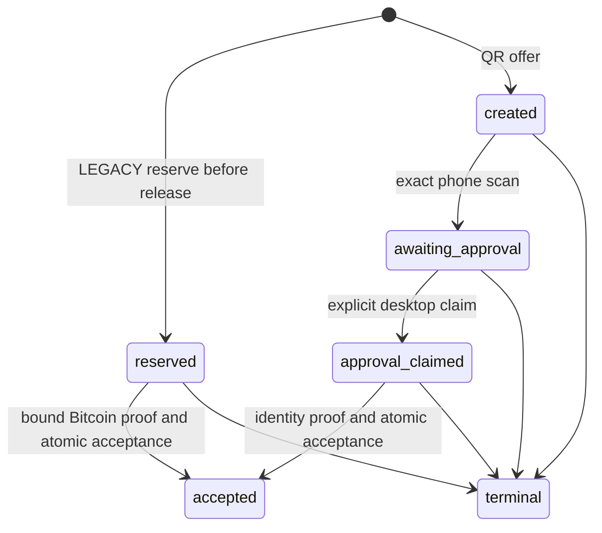

# Social mobile authorization persistence V1

This is the durable, repository-local companion to the
[mobile protocol](SOCIAL_MOBILE_DEVICE_AUTHORIZATION_V1.md). The protocol's
canonical bytes, signature domains, binding identities, and exchange identity
remain authoritative. The service and migration are dormant: there is no route,
factory registration, deployment, browser session issuer, or feature activation.

## Authority and continuity

`SqlAlchemyMobileAuthorizationService` receives an explicit SQLAlchemy session
factory. It refuses every database dialect except PostgreSQL, and every
transaction isolation level except READ COMMITTED. It never reads environment
configuration or falls back to Redis, memory, or a default database.
Each command also requires the migration's enabled replay/state triggers.
`Base.metadata.create_all` alone is not a supported activation path; a missing
or disabled guard fails closed before the command runs.

Desktop and LEGACY commands require a **trusted ingress** to supply the current
authenticated UBID durable `Session.session_id`, canonical subject, and original
`loginContext` or `desktopContext`. These are service parameters, not browser
JSON authorization. Each command locks and rereads the existing `Session` and
`User`, requiring an active user with exactly that subject, an active web/API
session, and `created_at <= now < expires_at`. Guest and LNURL session types
cannot enter this contract. The identity signature remains independently
required for acceptance, and Current-Full is separately checked in the same
transaction. Neither authentication nor acceptance grants entitlement.
Session creation is never rounded earlier; fractional session expiry is floored
to the protocol clock's whole second and never extended. Acceptance rechecks
session validity after acquiring mutation locks.

The reservation stores only a commitment to the authenticated generation:

```text
SHA256(ASCII("HODLXXI_SOCIAL_MOBILE_SESSION_CONTINUITY_V1" || NUL ||
  canonicalJSON([session_id, user_id, created_at.isoformat(), session_type,
                 canonical_subject, original_context])))
```

This is a storage continuity commitment, not a signature digest, proof ID,
request ID, or replacement for either Phase-1 context field. Its input is read
from trusted session storage. Mobile rows never copy the session credential.
Session replacement, invalidation through the existing durable session owner,
generation changes, user inactivity, subject changes, and context changes deny
completion, cancellation, and authenticated recovery.

**Browser integration prerequisite:** the current factory browser login stores
authentication in Flask session state; its logout clears that state. It does
not establish the above durable session mapping. An adapter must explicitly
establish the authenticated mapping and invalidate it on logout/replacement
before this service is wired to those flows. Generic OAuth claims, token
possession, a browser-supplied session identifier, or a cached continuity object
must not substitute for that adapter. The existing durable `sessions` model is
reused; no parallel bearer validator or email/password identity is introduced.

## Records and migration

The source migration
`migrations/2026-09-13_social_messaging_mobile_authorization_v1.sql` follows the
existing binding and binding-authorization migrations and must be applied in a
single separately authorized transaction. It creates:

| Table | Purpose |
| --- | --- |
| `social_messaging_device_authorization_requests` | Global immutable request ownership shared by mobile reservations and existing Nostr acceptance; backfilled from the established replay ledger. |
| `social_messaging_mobile_operations` | Immutable LEGACY reservation or QR offer and its one-shot proposal/state. |
| `social_messaging_mobile_acceptances` | Exact public proof, canonical accepted result, binding identity, acceptance timestamp, and the observed Current-Full proof identity/deadline. |
| `social_messaging_device_authorization_binding_owners` | One authorization owner for each canonical binding across the method-specific evidence tables; backfilled from existing evidence. |
| `social_messaging_mobile_exchanges` | One pending QR exchange attached to accepted non-revoke authorization, with the unchanged exclusive protocol deadline. |
| `social_messaging_mobile_session_handoffs` | One immutable confidential issuer work item containing the exact Phase-1 exchange identity and consumption timestamp. |

The established Nostr replay and evidence tables remain the owners of their
existing canonical results. Insert triggers claim the shared request/binding
identities for those tables. A mobile reservation excludes Nostr acceptance of
the same request, and existing Nostr acceptance excludes mobile reservation.
No Bitcoin signature is relabeled as a Nostr signature or routing proof.

Primary keys, unique constraints, foreign keys, immutable-row triggers, allowed
transition guards, and deferred receipt/state consistency triggers enforce the
one-shot boundaries. A terminal row cannot be reopened, a proposal cannot be
rebound, an accepted state cannot commit without its receipt, and an exchange
cannot attach to an unaccepted pairing or revocation. Handoff consumption has a
unique owner and must occur inside the original exclusive deadline.

LEGACY issuance accepts semantic content only. It generates a fresh UUID-v4
server-side, constructs the unchanged method envelope, and commits its immutable
reservation before returning the challenge. A caller cannot import an old
ordinary-login UUID/signature into this flow. Deterministic UUID injection is
available only as trusted service construction for fixed-vector tests.

DDL failure rolls back transactionally. After acceptance data exists, retaining
the replay history is mandatory; dropping these tables is not a safe operational
rollback. No migration is applied to any live environment by adding this source.

## State machine



The stored QR spellings are `awaiting-approval` and `approval-claimed`.
`terminal` means one of `cancelled`, `abandoned`, `rejected`, or `expired`, each
stored distinctly. All unaccepted states can terminate; none can reopen.
An accepted row remains `accepted` as historical evidence even after its binding
or exchange expires. This status never asserts current messaging readiness.

Creation, scan and approval claim grant neither a binding nor a session.
`claim_approval` is one-shot. If the signer aborts, the state remains claimed
until explicit terminal handling or expiry. A new attempt requires a new pairing
identity. The server never acquires a signer or requests another signature.

Expiry is exclusive, with no grace period. `status` and `phone_status` persist
expiry of unaccepted records using the earlier offer/proposal deadline. Fresh
acceptance always checks the authoritative deadline even before a status read.
Accepted proof/result records are never expired or deleted for replay purposes.

## Transaction boundary

Each public service command opens one outer transaction, performs its work,
flushes, and commits **before** returning. Failure at any step returns the single
non-sensitive `MobileAuthorizationUnavailable` contract and rolls back the whole
transaction. The service does not use helpers that commit independent sessions.

Acceptance serializes the operation and established global request namespace,
locks authenticated session/user and entitlement state, and reuses the existing
subject/device/public-key mutation locks. Within that same transaction it:

1. Rechecks the immutable reservation or claimed pairing and exact continuity.
2. Verifies the unchanged method-specific proof and exclusive deadlines.
3. Verifies Current-Full through the established transaction-bound verifier.
4. Validates predecessor authorization and invokes the real transaction-bound
   device-binding adapter, or checks the exact existing binding for adoption.
5. Persists the method-specific public evidence and exact canonical result,
   transitions the reservation/pairing to accepted, and claims shared binding
   ownership.
6. Creates the pending exchange record for QR register/rotate/adopt only.

All competing mutations use PostgreSQL locks and database uniqueness; there is
no process-local replay ledger. Equal concurrent requests can receive the same
committed result, while only one acceptance/binding write wins. A lost response
does not imply rollback and does not permit re-signing.

## Confidential service contracts

There are **no HTTP routes**. All methods fail closed with
`mobile device authorization unavailable`; an eventual transport must preserve
that non-sensitive outward failure and supply its own authenticated ingress.

| Method | Inputs beyond trusted identity context | Committed output |
| --- | --- | --- |
| `reserve_legacy` | Exact semantic content and original login context | Existing closed challenge/digest/deadline JSON for a fresh server UUID, released only after reservation commit. |
| `create_pairing` | Desktop context, revision and TTL | Existing `PairingOffer` and transient QR locator. Only its secret commitment is stored. |
| `pairing_offer_for_scan` | Confidential QR locator | Exact existing public `PairingOffer`, after secret-commitment and live offered-state checks; enables transcript construction and grants nothing. |
| `scan_pairing` | Exact source, locator and possession proof | Existing public `PairingState`; no grant. |
| `claim_approval` | Pairing ID, revision, authorization digest and human comparison code | `approval-claimed`; no grant. |
| `accept` | Operation identity, expected method/digest/revision, exact public proof | Closed canonical acceptance JSON or its exact persisted replay. |
| `close` | Operation identity and explicit cancelled/abandoned/rejected status | Committed terminal state; expiry takes precedence. |
| `status` | Operation identity and method | Closed `{authorizationDigest,status}` JSON. |
| `pairing_snapshot` | Pairing ID, desktop context and expected revision | Existing immutable `PairingOffer` or `PairingState` containing the exact public transcript for desktop inspection/signing. |
| `phone_status` | Pairing ID, revision, digest and separate exchange verifier | Same closed status, checked against the stored exchange commitment; no key material. |
| `recover_pairing_proposal` | Original public source, locator, possession proof, exchange verifier and revision | Same closed status, including `never-accepted` when the exact proposal was never committed; does not scan or reopen the offer. |
| `consume_exchange` | Pairing ID, subject, revision, digest and separate exchange verifier | Exact frozen `hodlxxi.social_phone_session_exchange_identity.v1` JSON, retained as the issuer handoff. |

The new accepted-result JSON has exactly `schema`, integer `version=1`,
`authorizationDigest`, `bindingId`, `subject`, and `requestId`; its schema is
`hodlxxi.social_mobile_authorization_acceptance.v1`. It is confidential metadata,
never bearer authority. Existing method source/proof parsers retain their
closed vocabulary, canonical ASCII encoding and size bounds. DB payload bounds
are 16,384 bytes for source/proof and 2,048 bytes for result/handoff.

## Recovery and session issuance

`accept` checks for a committed receipt before considering a fresh command.
Exact proof bytes are reverified at their persisted acceptance timestamp and
matched to the exact stored result. This permits historical result recovery
after authorization expiry without extending validity. Different proof bytes,
methods, operations, digests, subjects, contexts or revisions fail closed.
No committed receipt means no accepted authorization may be inferred.
`never-accepted` is a linearizable status observation, not cancellation of an
in-flight attempt. Device-local key disposal requires terminal cancellation or
expiry; a pending attempt may still commit after an earlier status observation.

`consume_exchange` uses the original Phase-1 function and exact accepted
revision. The QR secret cannot substitute for the independent phone verifier.
Fresh consumption also requires the accepted binding to remain active and
unchanged. It atomically inserts one immutable issuer handoff, without minting a
session. An equal retry returns that same historical handoff, including after
expiry; it cannot insert another work item or refresh its timestamp/deadline.
The identity object itself cannot be presented as login authority.

The eventual confidential Social session issuer must consume this durable work
item idempotently and recover its own exact issued-session result. It must bind
the session to the accepted subject/device, preserve expiry, and grant neither
Full nor operator status. Distributed delivery/acknowledgement and browser
cookie issuance are not implemented here. LEGACY retains its original bound
login continuation; it has no QR phone exchange and acquires no second signer.

Only public X25519 material inside the exact proposal/binding is persisted.
The QR secret and phone verifier are transient parameters; their commitments
are stored. Neither participant private keys nor device-local private X25519
CryptoKeys are accepted, recovered, serialized, logged or persisted.

## Required integration before activation

The browser/OAuth continuity mapping and logout invalidation, confidential
ingress/client authorization, session issuer delivery and recovery, Social UI
and device-local key reconciliation, and mobile-evidence routing verification
remain separate work. Existing routing consumers continue to recognize only
their established evidence format. Mobile acceptance must not be advertised as
live messaging readiness or silently substituted into that routing format.

Verification uses the repository's identity-checked disposable PostgreSQL
harness with synthetic users, sessions, entitlement and bindings. Tests include
actual migration execution/rollback, exact Phase-1 vectors, existing binding
consumers, request collisions, transaction failures, concurrency, lifecycle,
session swaps, replay and exchange recovery. No live infrastructure is needed.
